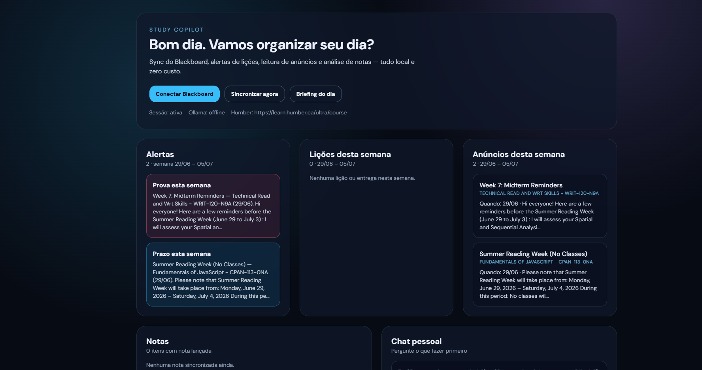

# Study Copilot

A personal assistant that reads your Blackboard, cuts through the noise, and tells you what actually matters this week. Runs entirely on your machine — no API keys, no subscriptions.

Built for [Humber College](https://learn.humber.ca)'s Blackboard Ultra, but the scraper is structured so you can point it at another campus with a few config changes.



## Why I built this

Blackboard holds everything — announcements, assignments, grades — but finding *what's due this week* means opening seven courses and reading walls of text. Half the deadlines aren't even in a date field; they're buried in an announcement from three weeks ago.

Study Copilot syncs that data locally, pulls dates out of the text when Blackboard doesn't, and shows a single dashboard: alerts, this week's work, and your grades. If you have [Ollama](https://ollama.com/) running, you can also ask "what should I do first?" and get an answer based on real synced data.

## What it does

- **SSO login** — Playwright opens Chromium, you sign in once (Microsoft/Humber), session is saved locally
- **Sync** — courses, announcements, course content, and gradebook columns
- **Weekly view** — only items with dates falling in the current calendar week (Mon–Sun), not your entire semester history
- **Alerts** — midterms, quizzes, and deadlines surfaced from announcement text
- **Morning briefing + chat** — optional, powered by Ollama

## Tech stack

| Layer | Tools |
|---|---|
| Backend | Python, FastAPI, Playwright, SQLite |
| Frontend | Next.js, React, Tailwind |
| AI | Ollama (`llama3.2` or whatever you prefer) |

Everything is free to run locally.

## How it works

Blackboard doesn't give students a stable public API. So instead of fighting that, the app:

1. **Logs in through the browser** (`login.py` runs as its own process so SSO popups work on Windows)
2. **Reuses the session** to hit internal REST endpoints found in DevTools:
   - `/learn/api/public/v1/users/me/courses`
   - `/learn/api/public/v1/courses/{id}/announcements`
   - `/learn/api/public/v1/courses/{id}/contents?recursive=true`
   - `/learn/api/public/v1/courses/{id}/gradebook/columns`
3. **Stores everything in SQLite** and serves it through a FastAPI backend

A few things I had to work around:

- **Playwright + uvicorn on Windows** — sync runs as a subprocess (`sync_job.py`) instead of inside the API process
- **Missing due dates** — most assignments come back with `due_at: null`, so dates get parsed from announcement bodies (`"Midterm on July 9"`, `"June 29, 2026"`, etc.)
- **Dashboard clutter** — a full sync can return 35+ announcements and 75+ items; the week filter keeps only what's relevant right now

```
Next.js (:3000)  ←→  FastAPI + SQLite (:8000)  ←→  Blackboard (Playwright session)
                              ↓
                         Ollama (optional)
```

## Project layout

```
study-copilot/
├── backend/
│   ├── app/scraper/       # browser login, Ultra API client, parsers
│   ├── app/services/      # alerts, week filtering, Ollama
│   ├── app/db/            # SQLite
│   ├── login.py           # standalone SSO login
│   └── sync_job.py        # sync subprocess
├── frontend/
│   └── components/Dashboard.tsx
└── start-all.ps1          # Windows shortcut to run both servers
```

## Getting started

You'll need Python 3.12+, Node 18+, and optionally Ollama.

**Ollama** (optional — for chat and briefing):

```bash
ollama pull llama3.2
ollama serve
```

**Backend:**

```powershell
cd backend
python -m venv .venv
.\.venv\Scripts\Activate.ps1
pip install -r requirements.txt
playwright install chromium
copy .env.example .env
uvicorn app.main:app --reload --port 8000
```

Edit `.env` for your campus (Humber is pre-configured in `.env.example`):

```env
BLACKBOARD_LOGIN_URL=https://learn.humber.ca
BLACKBOARD_COURSES_URL=https://learn.humber.ca/ultra/course
SYNC_HEADLESS=false
```

**Frontend:**

```powershell
cd frontend
npm install
npm run dev
```

Or on Windows, from the repo root:

```powershell
.\start-all.ps1
```

Then open **http://localhost:3000**, click **Connect Blackboard**, sign in, and hit **Sync now**.

## Don't commit these

`.env`, `data/session.json`, the SQLite database, and the browser profile are all gitignored. They contain your login session and personal data.

## Known rough edges

- Blackboard HTML and internal APIs vary by institution — you may need to tweak parsers for your school
- SSO sessions expire; reconnect when sync starts failing
- Chat and briefing need Ollama running; the dashboard works without it
- Not every assignment has a structured due date — text parsing isn't perfect

## License

MIT
